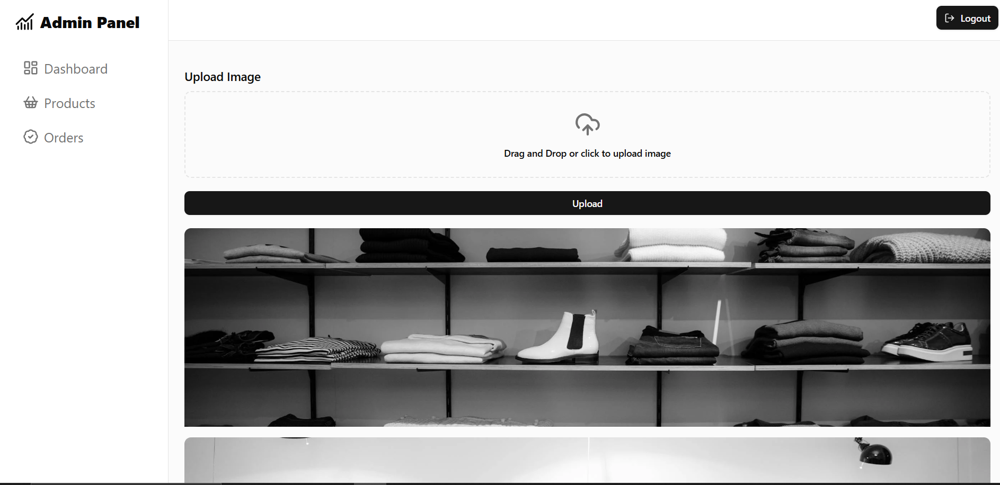
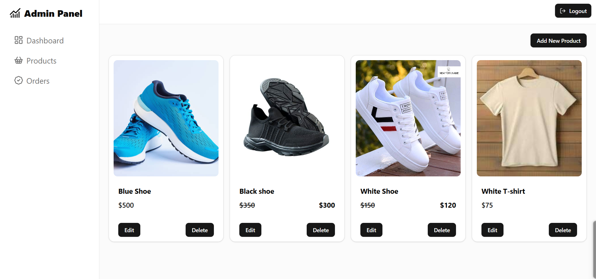
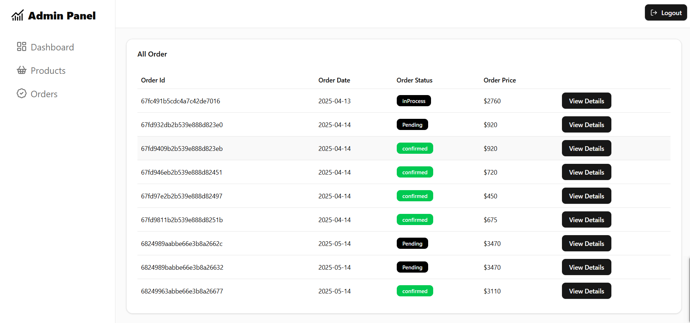
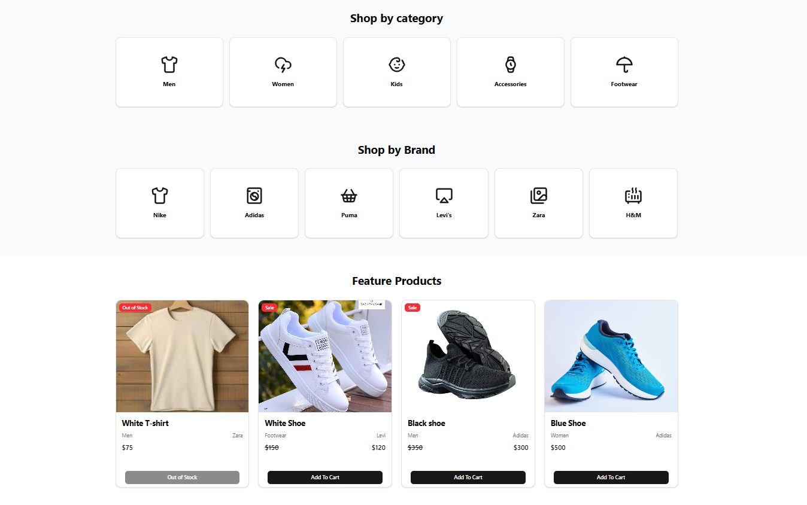
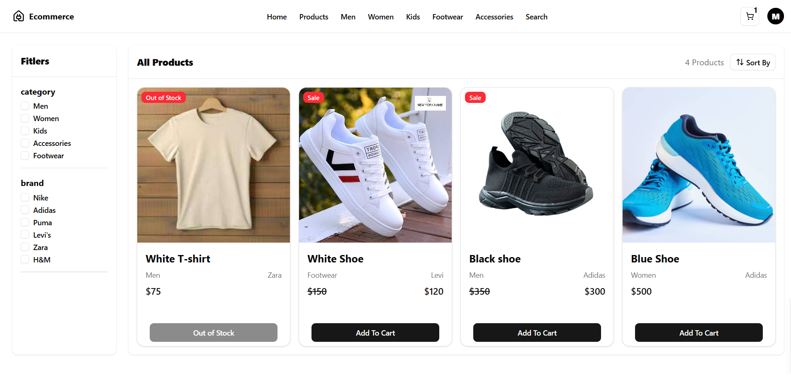
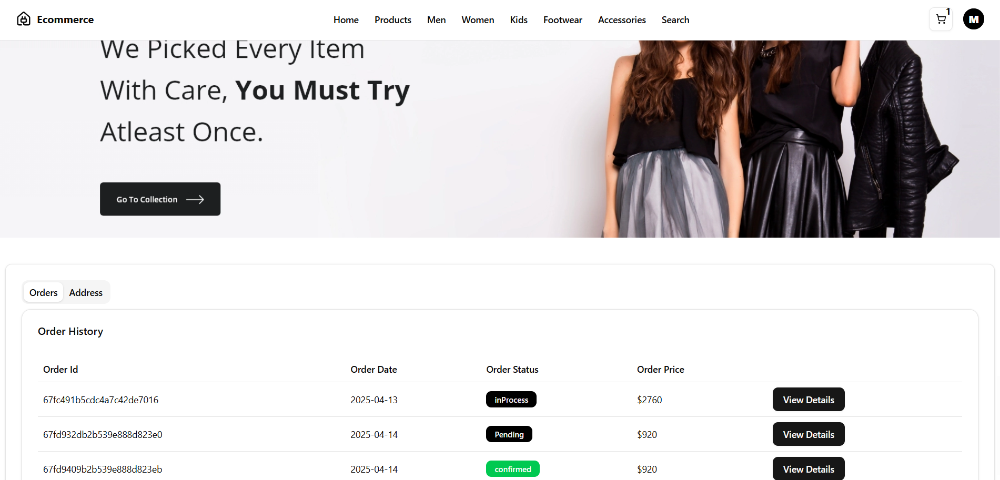
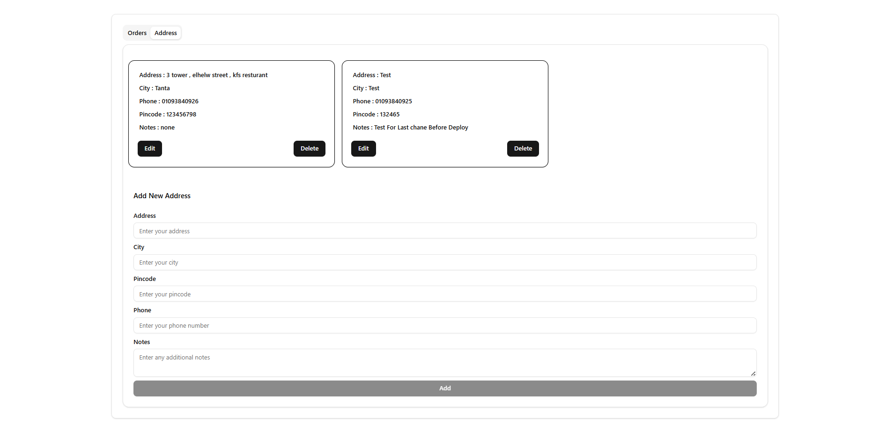
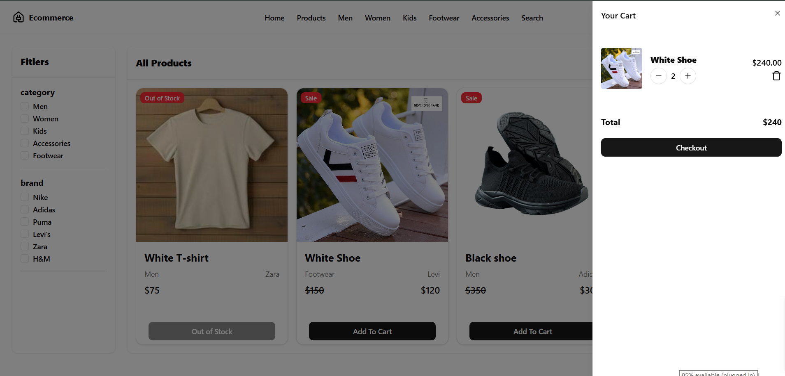
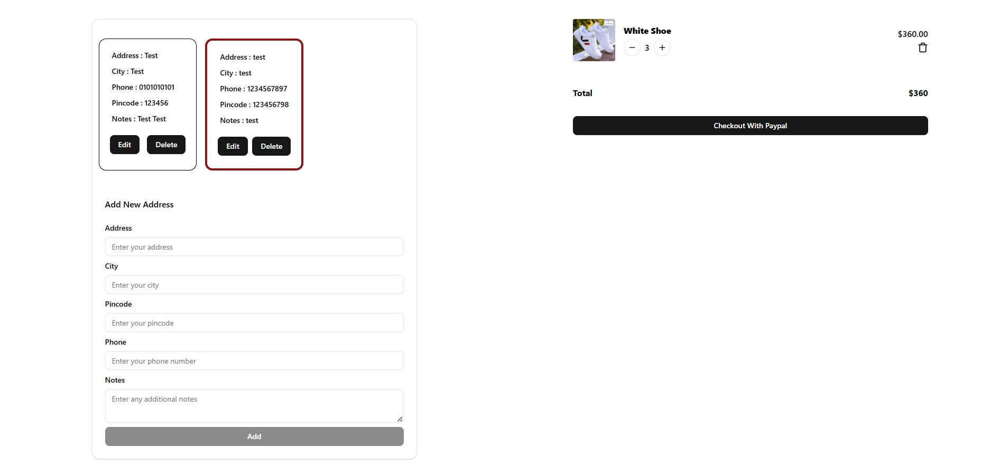

# 🛍️ E-Commerce Frontend Application

This is the frontend of a full-stack E-Commerce application, built using **React** and **Vite** to provide a fast and modern user experience.  
It integrates seamlessly with the [E-Commerce Backend API](https://github.com/MohammedOsamma/ECommerce-Back-end-) to support all e-commerce features from browsing products to order fulfillment.

---

## ✨ Key Features

- **User Authentication**: Secure user registration, login, and logout.
- **Product Browse**: View and explore available products.
- **Shopping Cart**: Add, edit, and remove items from the cart.
- **Address Management**: Add, update, and delete shipping addresses.
- **Order Processing**: Complete purchases with external payment support (like PayPal).
- **Search and Reviews**: Search for products and write reviews.
- **Admin Dashboard**: (If applicable) Manage products and orders.
- **Responsive Design**: Works across devices (mobile, tablet, desktop).

---

## 🛠️ Technologies Used

- **React 19** – Build interactive UIs.
- **Vite** – Fast frontend tooling.
- **Redux Toolkit** – Centralized state management.
- **React Router DOM v7** – Page navigation.
- **Tailwind CSS 4** – Utility-first CSS framework.
- **Tailwind CSS Animate** – Smooth animations.
- **Radix UI** – Accessible, unstyled components.
- **Axios** – HTTP requests.
- **Sonner** – Toast notifications.
- **Lucide React** – Icons library.
- **Next Themes** – Light/dark mode theme support.

---
## 🖼️ Project Screenshots

### 🔐 Authentication
**Login / Register**

---

### 🧑‍💼 Admin Dashboard
**Manage Products & Orders**

---

### 🏬 Home Page (Shop)
**Shop Home Interface**

---

### 🛒 Cart & Checkout
**Cart View & Checkout Flow**

---

## 🙏 Acknowledgements

- [Radix UI](https://www.radix-ui.com/)
- [Tailwind CSS](https://tailwindcss.com/)
- [Lucide Icons](https://lucide.dev/)
- And all the open-source contributors who made this possible!

